# Google Play Store Analysis

A data analysis project based on Google Play Store application data and user reviews. The project covers data cleaning, preprocessing, exploratory data analysis, comparative analysis, and sentiment analysis, with the results presented through an interactive Streamlit dashboard.

## Overview

The Google Play Store dataset contains information about applications such as ratings, reviews, installs, categories, pricing, size, and update information. Alongside it, the user reviews dataset provides review text and sentiment information.

The objective of this project is to transform the raw datasets into meaningful information through a complete data analysis workflow.

```text
Raw Data
   |
   v
Data Cleaning
   |
   v
Data Preprocessing
   |
   v
Exploratory Data Analysis
   |
   v
Comparative Analysis
   |
   v
Sentiment Analysis
   |
   v
Interactive Dashboard
```

## Dashboard

The analysis is presented through a Streamlit dashboard that brings the datasets, preprocessing steps, descriptive analysis, visualizations, and sentiment analysis together in one application.

### Home

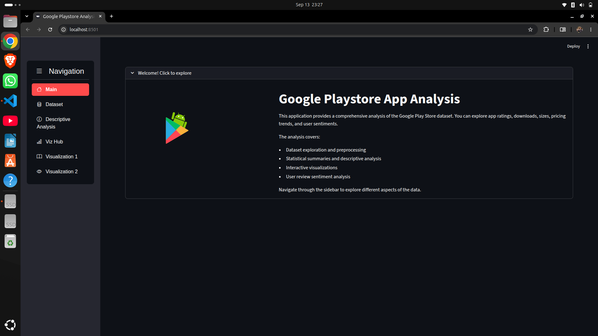

## Dataset

The project uses two datasets.

### Google Play Store Dataset

The main dataset contains information about applications available on the Google Play Store.

Important columns include:

* `App`
* `Category`
* `Rating`
* `Reviews`
* `Size`
* `Installs`
* `Type`
* `Price`
* `Content Rating`
* `Genres`
* `Last Updated`
* `Current Ver`
* `Android Ver`


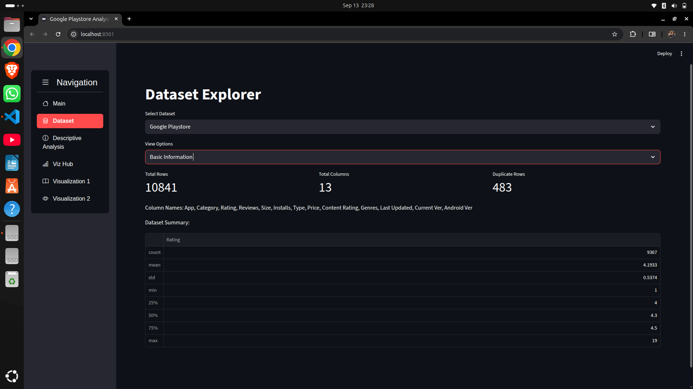

### User Reviews Dataset

The user reviews dataset contains reviews and sentiment information associated with applications.

Important columns include:

* `App`
* `Translated_Review`
* `Sentiment`
* `Sentiment_Polarity`
* `Sentiment_Subjectivity`

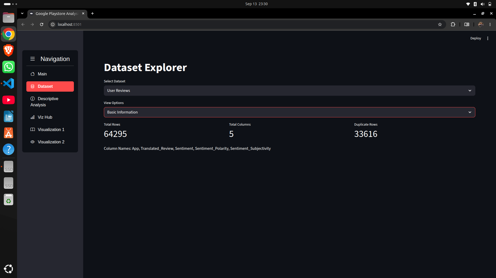

## Data Cleaning and Preprocessing

The raw Play Store data contains missing values, duplicate records, inconsistent formats, and values that need to be transformed before analysis.

The preprocessing process includes:

* removing invalid values from the `Reviews` column
* converting review counts to numeric values
* cleaning the `Installs` column
* converting installs to numeric values
* cleaning the `Price` column
* converting prices to numeric values
* converting application sizes into MB
* converting `Last Updated` into datetime format
* removing duplicate records
* handling missing numerical values
* handling missing categorical values
* identifying and removing extreme values
* creating additional variables required for analysis

Additional variables are created for analytical purposes, including:

* Update Year
* Installs Category
* Revenue

### Missing Values


### Data Types

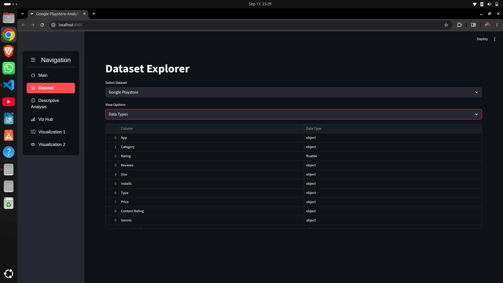

### Preprocessed Dataset

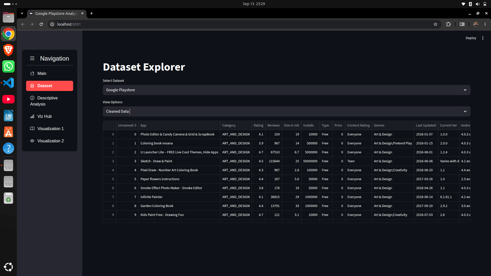

## Descriptive Analysis

The descriptive analysis provides an overview of the dataset before moving into comparisons and more detailed analysis.

The analysis examines:

* app ratings
* number of reviews
* number of installs
* application categories
* application types
* application prices
* application sizes
* numerical feature distributions

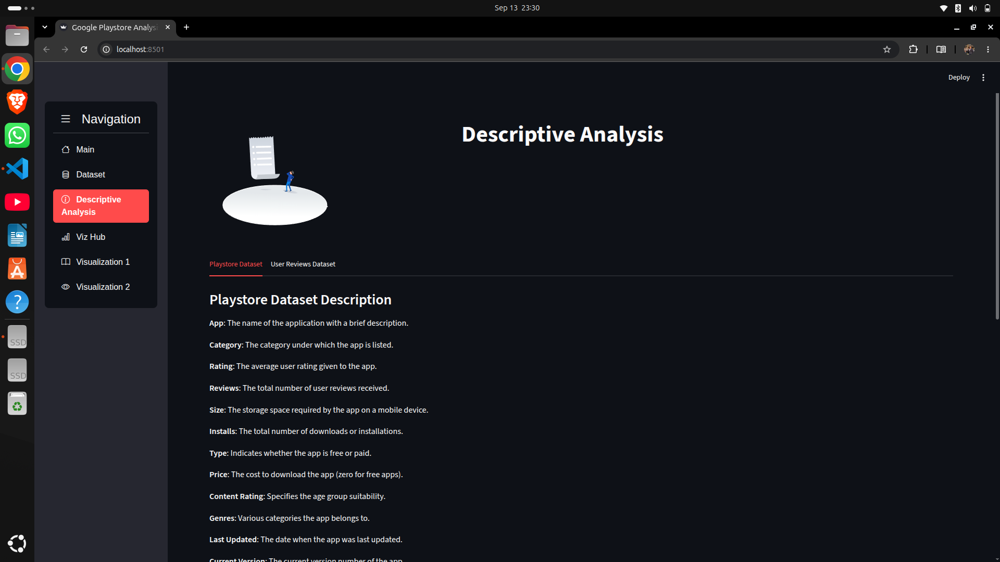


## Exploratory Data Analysis

The exploratory analysis focuses on understanding the structure of the Play Store ecosystem and identifying patterns within individual variables.

The analysis includes:

* distribution of application ratings
* distribution of numerical variables
* application count by category
* reviews versus installs
* free versus paid applications
* installs by application type
* top genres by installs
* rating trends by update year

### Visualization Dashboard

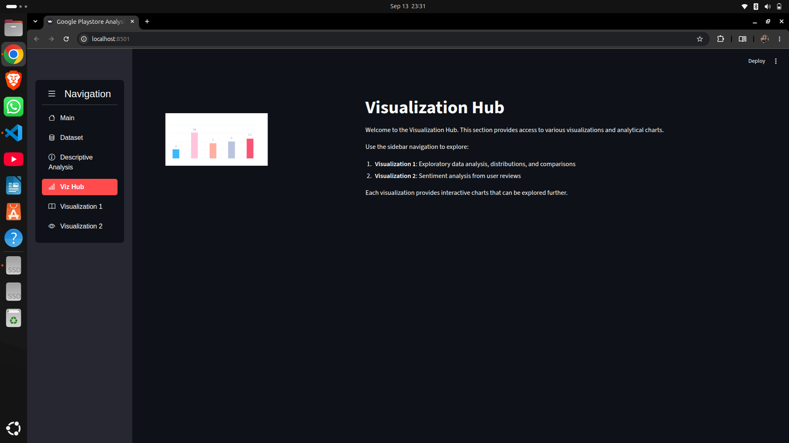

### Exploratory Analysis

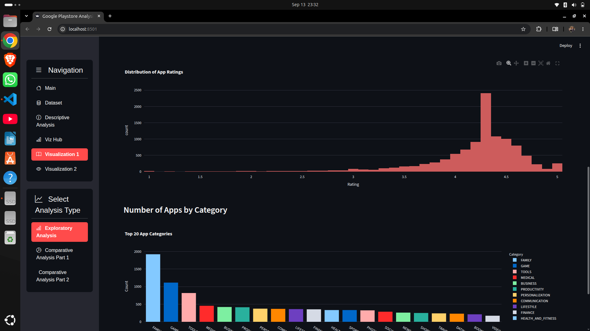

## Comparative Analysis

The project also compares different groups of applications to understand differences in performance.

The comparative analysis includes:

* free applications versus paid applications
* highest-rated paid applications
* highest-rated free applications
* most-reviewed free applications
* average revenue by category
* revenue versus installs
* installs by application type
* top genres based on installs
* rating trends across update years


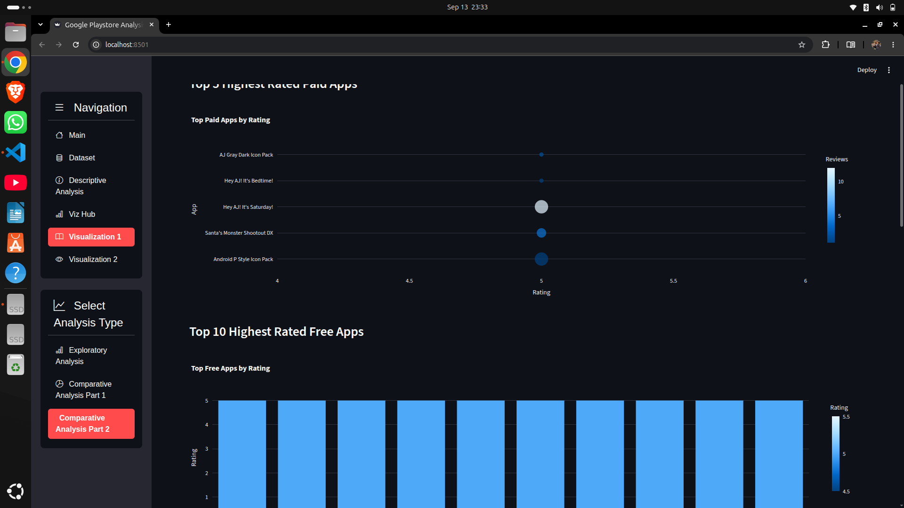

## Sentiment Analysis

The user reviews dataset makes it possible to analyze the opinions expressed by users rather than relying only on numerical application metrics.

The sentiment analysis uses:

* `Sentiment`
* `Sentiment_Polarity`
* `Sentiment_Subjectivity`

The analysis explores:

* positive, neutral, and negative reviews
* sentiment polarity
* sentiment by application category
* polarity and subjectivity
* relationships between sentiment and application characteristics

### Sentiment Polarity


### Sentiment by Category

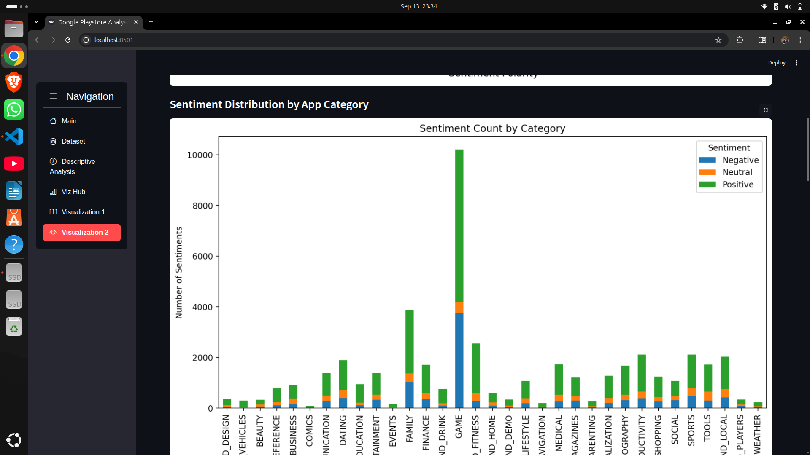

### Sentiment Subjectivity

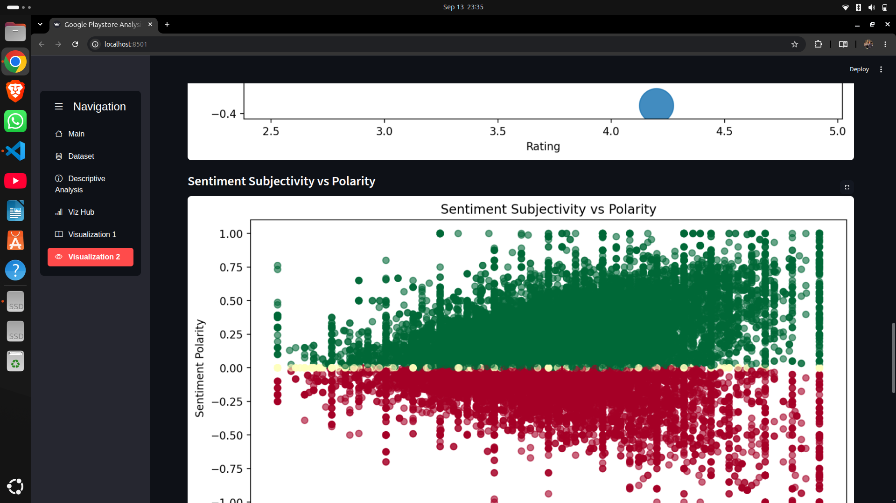

## Technology Stack

| Technology            | Purpose                        |
| --------------------- | ------------------------------ |
| Python                | Data processing and analysis   |
| Pandas                | Data cleaning and manipulation |
| Matplotlib            | Data visualization             |
| Seaborn               | Statistical visualization      |
| Plotly                | Interactive visualizations     |
| Streamlit             | Interactive dashboard          |
| Streamlit Option Menu | Dashboard navigation           |
| Streamlit Lottie      | Dashboard interface            |
| Jupyter Notebook      | Exploratory analysis           |

## Project Structure

```text
Play store project/
│
├── prac.py
├── app.ipynb
│
├── googleplaystore.csv
├── googleplaystore_user_reviews.csv
├── preprocessed_GPS.csv
│
├── README.md
│
└── images/
    ├── home.png
    ├── Dataset1.png
    ├── Dataset2.png
    ├── Dataset3.png
    ├── Dataset4.png
    ├── Dataset 5.png
    ├── Dataset6.png
    ├── Description1.png
    ├── Description2.png
    ├── VIzualitaion_main.png
    ├── Visulaization1-1.png
    ├── Visulaizationn1-2.png
    ├── VIsulizationn1-3.png
    ├── VIsulaization2-1.png
    ├── Visualization2-2.png
    ├── Visulaizationn2-3.png
    ├── Codingpart1.png
    ├── Coding  part 2.png
    ├── Coding part3.png
    └── Coding part 4.png
```

## Running the Project

### Clone the repository

```bash
git clone <repository-url>
cd "Play store project"
```

### Install dependencies

```bash
pip install pandas matplotlib seaborn plotly streamlit streamlit-option-menu streamlit-lottie statsmodels
```

### Run the Streamlit application

```bash
streamlit run prac.py
```

The application will open at the local Streamlit address provided in the terminal.

## Implementation

The project contains the Python code used for preprocessing, analysis, and visualization in addition to the Streamlit dashboard.

### Data Preprocessing Code


### Analysis Code

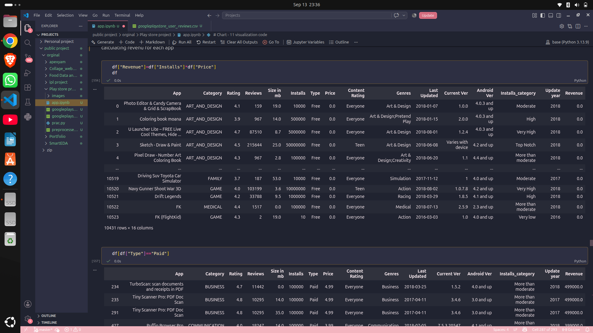

### Visualization Code

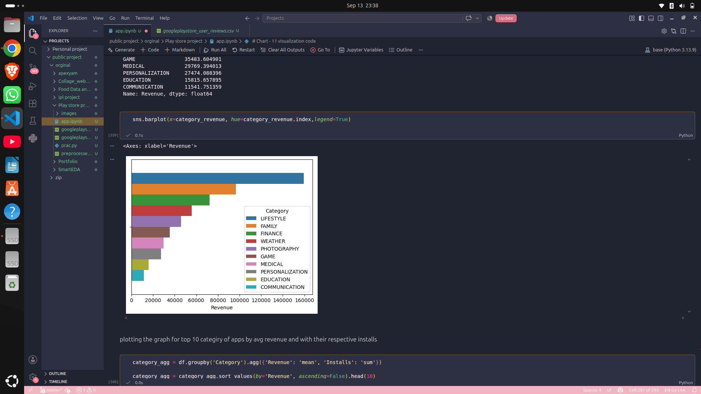

### Chart Generation

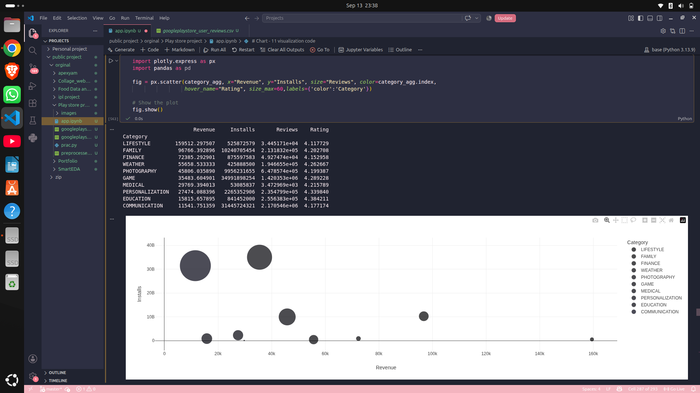

## Analysis Areas

The project focuses on:

* application ratings
* application popularity
* reviews
* installs
* application categories
* application genres
* free and paid applications
* application pricing
* estimated revenue
* user sentiment
* sentiment polarity
* sentiment subjectivity
* relationships between application metrics

## Future Improvements

Possible improvements for the project include:

* adding more interactive filters
* adding KPI cards for important metrics
* improving the dashboard interface
* adding more detailed revenue analysis
* applying more advanced NLP techniques to user reviews
* developing an application recommendation system
* deploying the dashboard publicly
* adding automated dataset updates

## Author

**Sai Satyam Biswal**

Data Analytics | Python | Streamlit | Data Visualization
